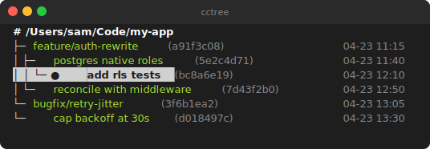

# cctree

Visualize [Claude Code](https://claude.com/claude-code) `/branch` session trees in your terminal, with an optional tmux sidebar that highlights the active session in your focused pane.



Claude Code doesn't ship a built-in way to see the tree of sessions you've forked with `/branch`. `cctree` reconstructs it by reading `~/.claude/projects/*/*.jsonl` (each fork records a `forkedFrom: {sessionId, messageUuid}` pointer) and renders it.

## Install

One-liner:

```bash
curl -fsSL https://raw.githubusercontent.com/penghou620/cctree/main/install.sh | bash
```

This clones the repo to `~/.local/share/cctree` and symlinks `cctree` and `cctree-sidebar` into `~/.local/bin`. Re-running updates to the latest commit. When run on a tty it prompts for the install dir, bin dir, and whether to append the `prefix + C-c` tmux binding to `~/.tmux.conf`.

Skip a prompt by setting its env var (each one falls back to the default on non-tty runs):

- `CCTREE_INSTALL_DIR`          — where to clone the repo (default `~/.local/share/cctree`)
- `CCTREE_BIN_DIR`              — where to symlink binaries (default `~/.local/bin`)
- `CCTREE_INSTALL_TMUX_BINDING` — `yes` / `no` / `ask` (default: `ask` on tty, else `no`)

Or do it manually:

```bash
git clone https://github.com/penghou620/cctree.git ~/Projects/cctree
ln -s ~/Projects/cctree/cctree         ~/.local/bin/cctree
ln -s ~/Projects/cctree/cctree-sidebar ~/.local/bin/cctree-sidebar
```

Requires Python 3 (standard library only) and, for the sidebar, `tmux`.

## Usage

```bash
cctree                      # tree for sessions whose cwd == $PWD (branched only)
cctree --all                # every project dir that has branches
cctree --path <dir>         # trees for a specific working dir
cctree --all-sessions       # include sessions that never branched
cctree --highlight <sid>    # render once with a session id marked (prefix match ok)
cctree --watch              # tmux-aware sidebar loop (see below)
cctree --version
```

### Labels

- Uses the session's `customTitle` if set, otherwise Claude's auto-generated `aiTitle`.
- `↑` marks a title inherited from the parent branch (sessions too short to generate their own).
- Untitled sessions fall back to their 8-char sid.
- Dates are right-aligned and reflect the session's last-modified time.

## Traverse the tree from inside Claude Code

Two slash commands are installed into `~/.claude/commands/`:

- **`/up`** — show the parent of the current session (the one `/branch` forked from)
- **`/down`** — list the children (sessions forked from this one)

Each prints a ready-to-copy `claude --resume <sid>` line. Because Claude Code can't swap sessions mid-conversation, you `/exit` and paste the command to actually move. The underlying subcommands work standalone too:

```bash
cctree --self     # sessionId of the enclosing claude process
cctree --up       # parent of current session
cctree --down     # children of current session
cctree --up   --sid 1e8801aa   # inspect any session by prefix
cctree --down --sid 1e8801aa
```

## Tmux sidebar

`cctree-sidebar` toggles a full-height 47-col pane on the left of the current tmux window running `cctree --watch`. Bind it in `~/.tmux.conf`:

```tmux
bind C-c run-shell "cctree-sidebar"
```

`prefix + C-c` opens the sidebar; hit it again to close. Focus stays on your working pane.

Env vars:

- `CCTREE_SIDEBAR_WIDTH` (default `47`) — pane width in cols
- `CCTREE_SIDEBAR_CMD`   (default `cctree --watch`) — command to run inside the pane

### How the active highlight works

When `--watch` is running, each tick it:

1. Queries the current tmux session for the focused pane (skipping itself).
2. Walks that pane's process descendants looking for a PID with a matching file under `~/.claude/sessions/<pid>.json`.
3. Uses that session's `cwd` to rescope the tree, and marks the row with `●` + bold/reverse video.

Works across panes — switch focus between Claude Code panes and the sidebar follows the active project.

## Notes

- Frames render via the alternate screen buffer with a buffered, in-place redraw (`\x1b[H` + per-line `\x1b[K` + trailing `\x1b[J`) so the view doesn't flicker.
- If a pane has multiple Claude Code processes nested inside it, detection picks the first descendant found — fine for typical one-Claude-per-pane usage.
